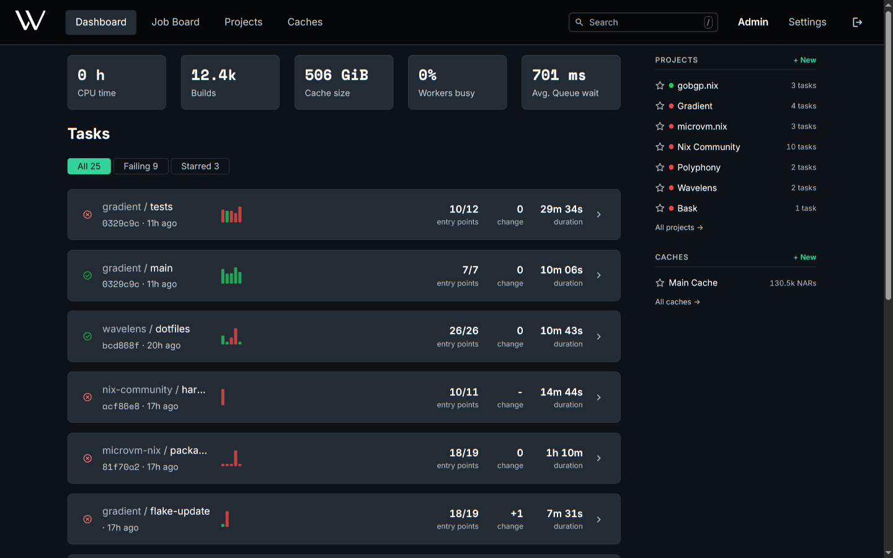

# Dashboard

The start page after sign-in, listing every task needing attention across all projects.

| Area | Content | Actions |
|---|---|---|
| Stats | CPU time, builds, cache size, busy workers and queue wait across the visible projects | |
| Filter | **Starred**, **All** and **Failing**, each with a count. **Starred** is the default, and hidden while no task is starred | Switch the task list. The choice stays in the URL |
| Task list | The top 10 tasks: latest commit, recent evaluations as bars, entry points ok/total, change in failures, speed | Open a task from the row, an evaluation from a bar. Page through every task with **Show all** |
| Activity | A calendar of the last year | Switch between evaluations and failures |
| Rail | Projects by rank, caches with starred first | Star a project or cache. Open its tasks |

Bar height in the task list is the duration. Bar color is the status.

New users without projects or caches see the first steps instead. These steps cover creating a project, adding a task, connecting a worker and creating or subscribing to a cache.

## Ranking

The task list has the tasks of the user's projects, plus starred tasks of public projects. Four tiers set the order of the list.

1. Starred and active
2. Active
3. Starred
4. Member only

A task is active with an evaluation other than a pull request in the last 14 days. The newest evaluation is first within a tier. Pull request evaluations count toward the stats only.

## Stars

- Star a project, task or cache from the page header, or a project or cache from the rail.
- Stars are personal. Stars rank and filter only the user's own view.
- Starred items come first in the task list, the rail and the command palette.

## Command Palette

`/` anywhere outside a text field, or the search field in the header.

| Query | Results |
|---|---|
| A name | Projects, tasks and caches, starred first |
| 7 to 40 hex characters | Commits by hash prefix |
| A store path or NAR hash | NARs in every readable cache |
| Empty | The starred items |

Arrow keys or Ctrl+J / Ctrl+K move the selection. Enter will open the item, and Escape will close the palette.

## Related

- [Projects and Tasks](../concepts/projects-and-tasks.md): the content of the task list
- [Evaluations and Builds](../concepts/evaluations-and-builds.md): the statuses behind the bars
