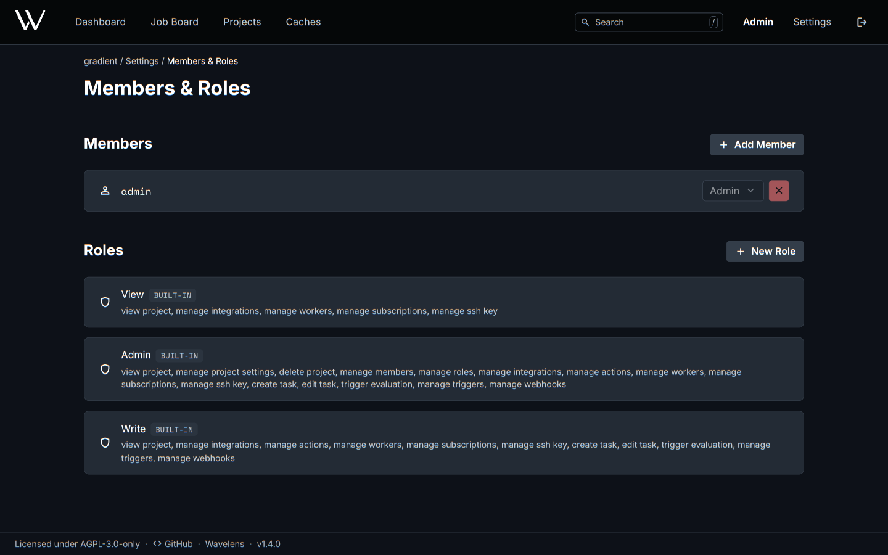

# Members and Roles

Who can do what in a project or a cache. Projects and caches each have their own members and roles. **Settings -> Members & Roles** on a project and **Members & Roles** on a cache lead there.

| Area | Content | Actions |
|---|---|---|
| Members | Every member with their role | Invite a user with **Add Member**. Change a role. Remove a member |
| Pending Invitations | Invitations not yet accepted | **Revoke** |
| Roles | The built-in roles and custom roles | **New Role**: a name and single permissions |

## Invitations

- **Add Member** will send an invitation. The user has no access before accepting the invitation on the **My Invites** page of the user settings.
- Invitations expire after 7 days. One user can hold at most one open invitation per project or cache.
- The invitee will also receive a link by mail with [email](../reference/configuration.md#email) configured.
- A superuser already holding the permission can add members directly.
- Projects and caches [declared in Nix](../guides/manage-with-nix.md) take their members from the configuration only.

## Project Roles

| Role | Can |
|---|---|
| Admin | Everything, including settings, members, roles and deleting the project |
| Write | Tasks, triggers, actions, evaluations, integrations, workers, webhooks, cache subscriptions, SSH key |
| View | See the project. Also change workers, integrations, cache subscriptions and the SSH key |

| Permission | Scope |
|---|---|
| `viewProject` | Seeing the project and its evaluations |
| `manageProjectSettings`, `deleteProject` | Editing or deleting the project |
| `manageMembers`, `manageRoles` | Inviting members, editing custom roles |
| `manageIntegrations`, `manageWebhooks` | Git host integrations and webhooks |
| `manageWorkers`, `manageSubscriptions`, `manageSshKey` | Workers, cache subscriptions and the SSH key |
| `createTask`, `editTask` | Creating and editing tasks |
| `manageTriggers`, `manageActions` | Triggers and actions on tasks |
| `triggerEvaluation` | Starting and aborting evaluations |

## Cache Roles

| Role | Can |
|---|---|
| Admin | Everything |
| Write | See the cache, download and upload paths |
| View | See the cache and download paths |

| Permission | Scope |
|---|---|
| `viewCache` | Seeing the cache |
| `readStore`, `writeStore` | Downloading and uploading paths |
| `manageCacheSettings`, `deleteCache` | Editing or deleting the cache |
| `manageCacheKeys`, `manageUpstreamCaches` | Signing keys and upstream caches |
| `manageCacheMembers`, `manageCacheRoles` | Members and custom roles |
| `manageCacheSubscriptions` | Approving project subscriptions |
| `manageCacheWebhooks` | Cache webhooks |

## Rules

- Built-in roles cannot be edited or deleted.
- A custom role still assigned to a member cannot be deleted.
- The last Admin of a cache cannot be removed.
- Roles can come from identity provider groups, described in [Set Up Single Sign-On](../guides/sso.md#3-map-groups-to-roles).

## Related

- [Share a Cache](../guides/share-a-cache.md): subscriptions and cache members
- [Caches](../concepts/caches.md#roles): the roles in context
