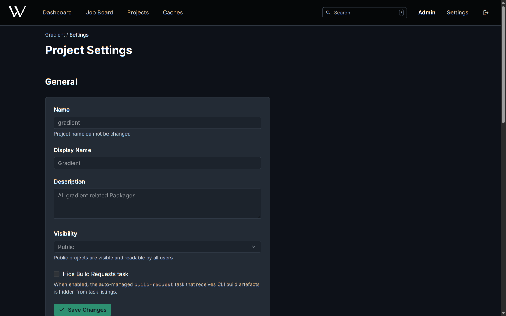

# Settings

Three settings pages: the user's own, a project's and a cache's. Fields of entities [declared in Nix](../guides/manage-with-nix.md) show disabled, with the hint **Managed by Nix**.

## User Settings

**Settings** in the header.

| Page | Shows | Actions |
|---|---|---|
| Profile | Username, full name, email | Edit; pick the theme under **Appearance**; **Delete Account** |
| API Keys | Keys with their scope and permissions | **New API Key**, edit, revoke, delete |
| Sessions | Every device signed in to the account | **Revoke** a session |
| My Invites | Open invitations to projects and caches | Accept or decline |

The theme (**System**, **Light**, **Dark**) is stored per browser, not per account.

## Project Settings

**Settings** on the project page.

| Section | Shows | Actions |
|---|---|---|
| General | Name, display name, description, visibility | Edit; **Hide Build Requests task** hides the task holding `gradient build` runs from task lists; the runs continue |
| More Settings | Links to Members and Roles, Workers, Cache Subscriptions, Integrations, Webhooks | Open each page |
| SSH Key | The public key the project clones with | Copy as a deploy key on the Git host |
| Danger Zone | | **Regenerate Key**, the old key stops working at once; **Delete Project** |

A public project shows its evaluations and builds to everyone, signed in or not.

## Cache Settings

**Settings** on the cache page.

| Field | Effect |
|---|---|
| Priority | Advertised to Nix clients in `nix-cache-info`; lower wins, default `10` |
| Local Priority | Priority for clients from `services.gradient.http.localIps`; empty keeps **Priority** |
| Max Storage (GB) | New evaluations wait when every writable cache of the project has less than 10 MiB left; `0` is unlimited |
| Visibility | A public cache serves paths without credentials |

The cache page also holds **Upstreams**, **NARs**, **Members & Roles**, **Subscriptions** and **Webhooks**.

## Related

- [Members and Roles](members-and-roles.md): members, invitations and permissions
- [Caches](../concepts/caches.md): upstreams and substitution order
- [Share a Cache](../guides/share-a-cache.md): subscriptions and netrc
